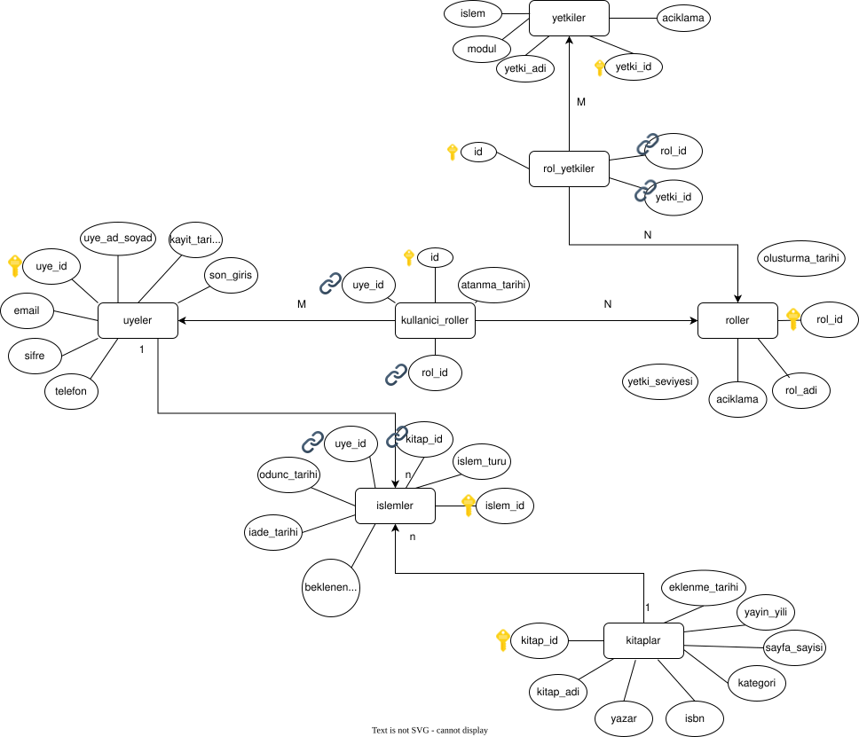

---

# 📚 KTU Kütüphane Yönetim Sistemi (Full-Stack)

Bu proje, **Karadeniz Teknik Üniversitesi (KTÜ)** için geliştirilmiş, **.NET Core Web API** ve **MySQL** altyapısı ile güçlendirilmiş modern bir dijital kütüphane yönetim sistemidir.

Proje, statik bir arayüz tasarımından dinamik veri yönetimine geçiş yapmış, Frontend (HTML/JS) ve Backend (C#) mimarisini başarıyla birleştirmiştir.

---

## 🎯 Proje Amacı

* Kütüphane işlemlerinin dijitalleştirilmesi.
* Kitap ve üye yönetiminin optimize edilmesi.
* Kullanıcı dostu, modern web arayüzü sunulması.
* Responsive tasarım ile her cihazda kullanılabilirlik.
* KTÜ öğrenci ve personeli için entegre kütüphane deneyimi.

---

## ✨ Temel Özellikler

### 👨‍💼 Yönetici Paneli

* **📊 Dashboard**: Gerçek zamanlı istatistikler ve özet bilgiler.
* **📚 Kitap Yönetimi**: Veritabanı bağlantılı ekleme, silme ve listeleme.
* **👥 Üye Yönetimi**: Öğrenci, personel ve akademisyen kaydı.
* **🔍 Gelişmiş Arama**: Anlık kitap arama ve filtreleme.

### 👨‍🎓 Kullanıcı Arayüzü

* **🏠 Kişisel Dashboard**: Ödünç alınan kitaplar ve durum takibi.
* **📖 Kitap Kataloğu**: Görsel kitap kartları ve durum (Mevcut/Ödünç) takibi.
* **📑 Kitaplarım**: Mevcut ödünç alınan kitapların yönetimi.
* **📅 Rezervasyonlar**: Kitap rezervasyon sistemi.

---

## 🏗️ Teknik Yapı (Tech Stack)

### **Backend Teknolojileri**

* **ASP.NET Core Web API (.NET 8.0)**: Modern, hızlı ve ölçeklenebilir API.
* **Entity Framework Core**: ORM yapısı ile veritabanı işlemleri.
* **MySQL**: İlişkisel veritabanı.
* **REST API**: Frontend ile backend arasında JSON veri iletişimi.
* **Swagger UI**: API test ve dokümantasyon arayüzü.

### **Frontend Teknolojileri**

* **HTML5 & CSS3**: Modern semantik yapı ve Responsive tasarım.
* **JavaScript (ES6+)**: Fetch API ile Backend iletişimi.
* **Font Awesome**: Profesyonel ikon seti.

### **Tasarım Sistemi**

* **Ana Renk**: #1a237e (KTÜ Mavi)
* **Tasarım**: Material Design ilkeleri.
* **Responsive**: Mobile-first yaklaşımı.

---

## 📊 **Veritabanı ER Diagramı**



*Yukarıdaki diagram, sistemin tüm tablo ilişkilerini ve veri yapısını göstermektedir.*

---
## 🏗️ Proje Dosya Yapısı

```text
/kutuphane_projesi
│
├── /Frontend (Arayüz Dosyaları - Root)
│   ├── index.html              # Admin Dashboard
│   ├── kitaplar.html           # Kitap Yönetimi (Tablo Görünümü)
│   ├── user-kitaplar.html      # Kullanıcı Kitap Kataloğu (Kart Görünümü)
│   ├── kitaplar-backend.js     # Admin paneli API bağlantısı
│   ├── ukitaplar-backend.js    # Kullanıcı paneli API bağlantısı
│   ├── style.css               # Admin CSS
│   ├── ustyle.css              # Kullanıcı CSS
│   └── /images                 # Logo ve medya dosyaları
│
└── /KutuphaneApi (Backend - ASP.NET Core)
    └── /ktphnAPI
        ├── /Controllers
        │   └── KitaplarController.cs     # API Uçları (Garson)
        ├── /Data
        │   └── AppDbContext.cs           # EF Core veritabanı bağlantısı
        ├── /Models
        │   ├── Kitap.cs                  # Veri model sınıfı
        │   └── KitapDurum.cs             # Enum tanımları
        ├── Program.cs                    # API başlangıç ayarları (CORS, Routing)
        └── appsettings.json              # MySQL bağlantı ayarları
```


## 🛠️ Geliştirilecek Özellikler

###(Yakında)

* JWT kimlik doğrulama
* E-posta bildirim sistemi
* Gelişmiş arama
* Loglama & hata yönetimi

### (Uzun Vadeli)

* Mobil uygulama (Flutter)
* QR kod ile hızlı ödünç alma
* Yapay zeka kitap öneri sistemi

---

## 📄 Kod Standartları

* **HTML:** Semantic + WCAG uyumlu
* **CSS:** BEM + mobile first
* **JS:** ES6+ standartları
* **Commit:** Conventional Commits

---

## 📊 Proje İstatistikleri


**Son Güncelleme**: Kasım 2025  
**Sürüm**: v0.2
**Durum**: Aktif Geliştirme 🚀